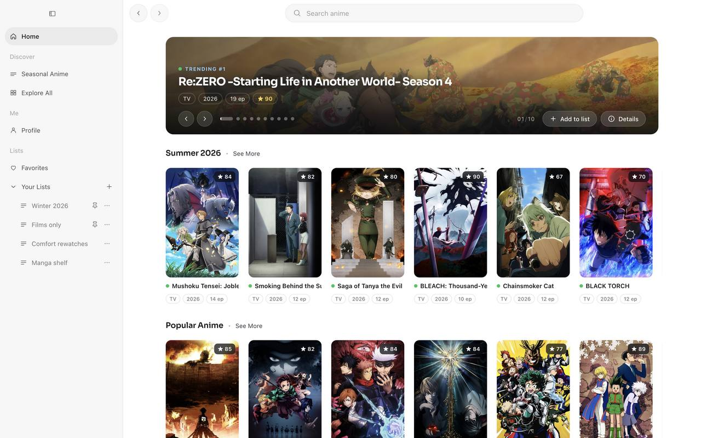
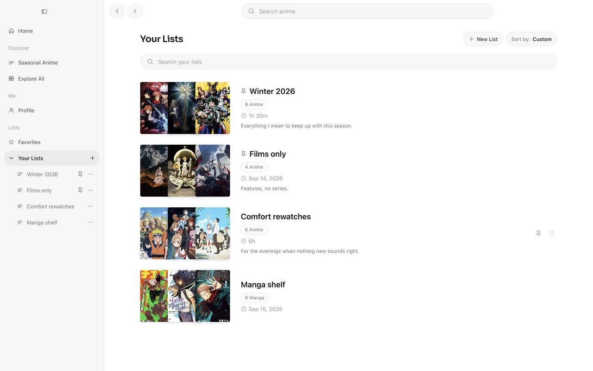

# Anime List

A desktop anime and manga database explorer for macOS. It calls AniList's public
GraphQL API from the renderer and keeps your lists in local storage, so there is
no backend and no account.



## Features

- Home: a hero, the current season, popular titles, a manga shelf, the schedule
- Seasonal Anime: any quarter, in the order you pick
- Explore All: the whole catalogue, filtered and searched server-side
- A title: information, related titles, characters, staff, stats,
  recommendations
- Lists: Favorites plus your own, with pinning, drag ordering and sorting
- The sidebar mirrors your lists and can pin them from its own menu
- Alt with the arrow keys moves a focused list row
- Profile with a picture, banner and counts



AniList's terms do not allow using the API as a storage service, so this is for
personal use.

## Running it

macOS 12 or later and Node 20.19+.

```sh
npm install
npm run electron    # build the renderer and open the window
npm run package     # a standalone `Anime List.app` in release/
```

## Layout

```
src/contracts/   read models and shared types
src/platform/    AniList transport, local storage for lists, profile, layout
src/ui/          generic components and hooks, React and contracts only
src/features/    one folder per surface; no feature imports another
src/app/         composition root: routing, shell, providers
src/styles/      one stylesheet per surface, tokens in theme.css
electron/        main process: window, menu, ready signal, gestures
scripts/         the branding and packaging steps
```
